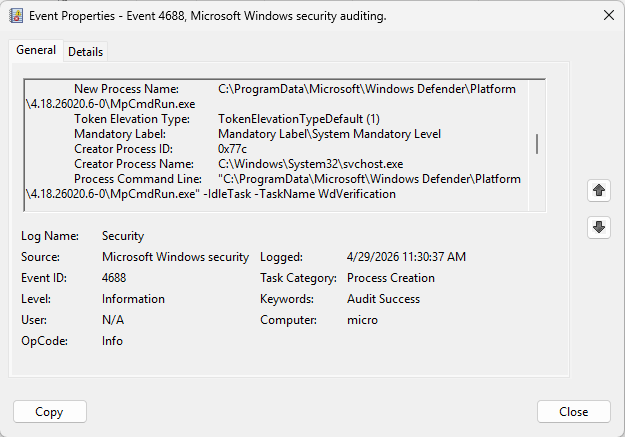

# Windows Event Log Investigation

## Objective
Analyze Windows Security Event Logs to identify suspicious login and process activity.

---

## Events Investigated
- Event ID 4625 – Failed Login
- Event ID 4624 – Successful Login
- Event ID 4688 – Process Creation

---

## Investigation Summary
Multiple failed login attempts were observed followed by a successful login and command execution activity.

---

## Analysis
The sequence may indicate password guessing activity followed by reconnaissance behavior.

---

## Findings
- Repeated failed logins detected
- Successful login observed
- whoami.exe executed after login

---

## Screenshots
### Artifact Analysis: Process Creation (Event ID 4688)
To baseline normal activity on the host, I investigated successful process creations. 

* **Analysis:** The log shows `MpCmdRun.exe` (Windows Defender) executing an idle task (`WdVerification`). This is a standard system baseline execution and does not indicate malicious persistence or privilege escalation.

